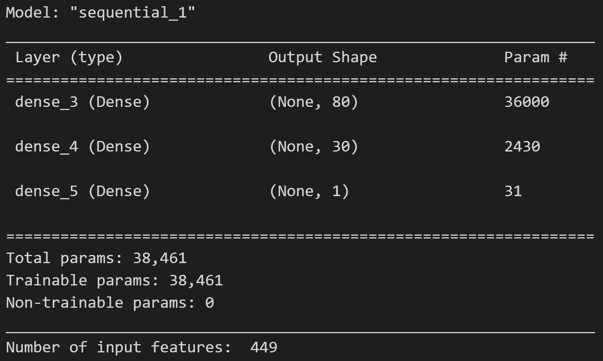

# deep-learning-challenge
## Background
The nonprofit foundation Alphabet Soup wants a tool that can help it select the applicants for funding with the best chance of success in their ventures. With my knowledge of machine learning and neural networks, I used the features in the provided dataset to create a binary classifier that can predict whether applicants will be successful if funded by Alphabet Soup.
## Results
### Data Preparation
The following actions were performed to prepare the data:
- The EIN and NAME columns were dropped because they are neither targets nor features.
- Data was split in training and testing sets.
- The target binary variable is "IS_SUCCESSFUL" (1=Yes, 0=No).
- The CLASSIFICATION variable was used for binning purposes.
- get_dummies was used to encode categorical varaibles.
### Compiling, Training, and Evaluation of the Model
Three layers were included. The number of input features was 45. The number of hidden nodes in each layer were as listed below:
- Hidden_nodes_layer1=80
- Hidden_nodes_layer2=30
- Hidden_nodes_layer3=1
- A total of 6,141 parameters were created 
- The accuracy of the model was 72.7%, slightly below the target of 75%.
Figure 1 and 2 below shows a partial view of the outputs.
 

 
Figure 1
 

 
Figure 2
